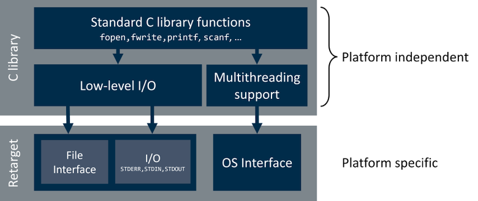

# Overview {#mainpage}

**CMSIS-Compiler** provides software components that simplify retargeting of standard C run-time library functions.

Application code frequently uses standard C library functions, such as `fopen`, `fwrite`, `printf()`, `scanf()` and others to perform input/output operations. These functions may as well be used in a multithreaded environment.

The structure of these functions in the standard C run-time library together with the retarget interfaces is:

Standard C library functions are platform independent and can be easily ported, while the low-level interfaces needs to be tailored to the chosen platform. Generally low-level I/O functions serve to interact with the file system and a serial interface, i.e. terminal. Multithreading support is available for applications that run on top of an RTOS kernel.

CMSIS-Compiler enables platform specific retargeting by providing software components that break down into the following interfaces:

- File interface that enables reading and writing files
- STDIN interface that enables standard input stream redirection
- STDOUT interface that enables standard output stream redirection
- STDERR interface that enables standard error stream redirection
- OS interface that enables multithread safety using an arbitrary RTOS

The pages \ref rt_io and \ref rt_os explain the details about how retargeting is done using the provided components.

Using CMSIS-Compiler developers can retarget standard I/O streams and file operations to specific platform and enable thread safe operations using RTOS interface.

> **Note**
> - CMSIS-Compiler replaces and extends retargeting functionality previously provided as part of *Keil::ARM_Compiler* pack.
> - See [Migrating projects from CMSIS v5 to CMSIS v6](https://learn.arm.com/learning-paths/microcontrollers/project-migration-cmsis-v6) for a guidance on updating existing projects to CMSIS-Compiler.

## Supported Toolchains {#toolchains}

The CMSIS-Compiler component is available for the following toolchains:

- [Arm Compiler for Embedded](https://developer.arm.com/Tools%20and%20Software/Arm%20Compiler%20for%20Embedded)
- [Arm GNU Toolchain (GCC)](https://developer.arm.com/Tools%20and%20Software/GNU%20Toolchain)

Support for IAR Compiler support will be added in a future revision of the CMSIS-Compiler.

## Access to CMSIS-Compiler {#compiler_access}

CMSIS-View is actively maintained in [**CMSIS-Compiler GitHub repository**](https://github.com/ARM-software/CMSIS-Compiler) and is released as a standalone [**CMSIS-Compiler pack**](https://www.keil.arm.com/packs/cmsis-compiler-arm/versions/) in the [CMSIS-Pack format](https://open-cmsis-pack.github.io/Open-CMSIS-Pack-Spec/main/html/index.html).

The table below explains the content of **ARM::CMSIS-Compiler** pack.

 Directory                             | Description
:--------------------------------------|:------------------------------------------------------
 📂 documentation                      | Folder with this CMSIS-Compiler documenation
 📂 example                            | \ref rt_example
 📂 include                            | Header files with [**Retargeting functions**](topics.html)
 📂 source                             | Compiler-specific implementations of regargeting functions
 📂 template                           | \ref rt_templates "User Template files"
 📄 ARM.CMSIS-Compiler.pdsc            | CMSIS-Pack description file
 📄 LICENSE                            | License Agreement (Apache 2.0)

See [CMSIS Documentation](https://arm-software.github.io/CMSIS_6/) for an overview of CMSIS software components, tools and specifications.

## Documentation Structure {#doc_content}

This documentation contains the following sections:

- \ref rev_hist : lists CMSIS-Compiler releases.
- \ref rt_io : explains low-level I/O retargeting, list available components and describes available user code templates.
- \ref rt_os : explains multithreading support retargeting, list available components and describes available user code templates.
- \ref usage : instructs how to enable and use the CMSIS-Compiler software components.
- \ref rt_example shows how to retarget the output to a UART on an Arm Virtual Hardware model.
- \ref rt_templates : contains the user code template files for the different use cases.
- [**API Reference**](topics.html) describes the API and the functions of the CMSIS-Compiler components in details.

## License {#doc_license}

CMSIS-Compiler is provided free of charge by Arm under the [Apache 2.0 License](https://raw.githubusercontent.com/ARM-software/CMSIS-Compiler/main/LICENSE)
