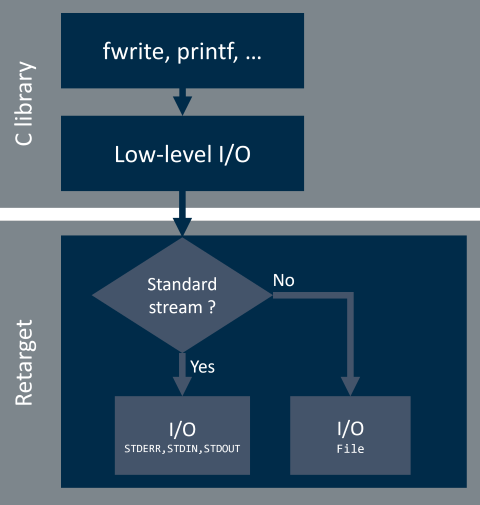
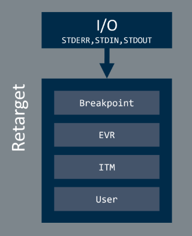

# Low-Level I/O Retarget {#rt_io}

CMSIS-Compiler splits low-level I/O retargeting into **standard I/O stream** related components and **file stream** related components.

The low-level I/O retarget decision tree is shown below:

Low-Level I/O retargeting implementation checks whether the incoming stream is a standard stream (i.e. stderr, stdin, stdout) or a file system related stream and redirects incoming request to the appropriate software component. Chapters \ref rt_io_components and \ref rt_file_interface explain these software components in detail.

## Standard Stream Components {#rt_io_components}

Software components that retarget the standard C library input/output streams are as follows:

 Component  |  Description
:-----------|:--------------------
 **STDERR** | Standard error stream of the application to output diagnostic messages.
 **STDIN**  | Standard input stream going into the application (`scanf` etc.).
 **STDOUT** | Standard output stream of the application (`printf` etc.).
 **TTY**    | Teletypewriter, which is the last resort for error output.

> **Note**
> - **TTY** is only available for Arm Compiler toolchain.

Each component can have various \ref rt_io_subcomponents.

### Standard Stream Subcomponents {#rt_io_subcomponents}

The subcomponent selection allows you to change the target hardware interface of the I/O stream.

#### STDERR/STDIN/STDOUT Subcomponents {#rt_io_std_subcomponents}

The following subcomponents are available:

 Variant              | Description
:---------------------|:-------------------
**Breakpoint**        | When the I/O stream is used, the application stops with [BKPT](https://developer.arm.com/documentation/100073/latest/The-Arm-C-and-C---Libraries/Support-for-building-an-application-with-the-C-library/Using-the-C-and-C---libraries-with-an-application-in-a-semihosting-environment?lang=en) instruction. No additional code is required.
**Event Recorder**    | STDOUT and STDERR can be redirected using the [Event Recorder](https://arm-software.github.io/CMSIS-View/main/evr.html) (especially interesting for targets without ITM (such as Cortex-M0/M0+/M23)).
**ITM**               | Use [Instrumentation Trace Macrocell (ITM)](https://developer.arm.com/documentation/ddi0314/h/Instrumentation-Trace-Macrocell?lang=en) for I/O communication via the debugger (only available for Cortex-M3/M4/M7/M33/M55/M85 processors).  Usually, data is shown in a dedicated window.  No additional code is required to output or input data through the ITM channel. However, you have to configure the ITM channel for tracing.
**Custom**            | Retarget I/O stream to a user defined interface (such as UART or other application specific interface). See \subpage custom_subcomponent for further details.

> **Note**
> - Depending on the selected subcomponent, certain `#define` are set in the header file **RTE_Components.h** that enable the appropriate code sections in the retarget core implementation.
> - Retargeting **STDOUT** and **STDERR** using the *Event Recorder* variant is available for all Cortex-M based devices.
> - The [microlib](https://developer.arm.com/documentation/100073/latest/The-Arm-C-Micro-library?lang=en) of Arm Compiler C run-time library interfaces to the hardware via low-level functions. It implements a reduced set of high-level functions and therefore does not implement system I/O functions. Thus, in case of using the microlib, you cannot redefine the system I/O functions. Using any of the features of the Arm Compiler component provides the [assert](https://developer.arm.com/documentation/101754/latest/armasm-Legacy-Assembler-Reference/armasm-Directives-Reference/ASSERT-directive?lang=en) facility for microlib.

### "Custom" Subcomponent {#custom_subcomponent}

The **Custom** component provides code template that helps you to implement the retarget interface functionality for custom interfaces that are not mentioned above.

The following user code templates are available:

 Component     | Name                 | File Name
:--------------|:---------------------|:-----------------------------------
 STDOUT:Custom | STDOUT User template | \ref stdout_user_c "stdout_user.c"
 STDIN:Custom  | STDIN User template  | \ref stdin_user_c "stdin_user.c"
 STDERR:Custom | STDERR User template | \ref stderr_user_c "stderr_user.c"
 TTY:Custom    | TTY User template    | \ref tty_user_c "tty_user.c"

## File Interface Components {#rt_file_interface}

**CMSIS-Compiler:File Interface** software component provides generic shim layer interface between the C library and an arbitrary file system implementation.

Standard C library functions interact with files in a same manner as with standard I/O streams and offer the same retargeting interface. The existing interface is split to enable component interchangeability and \ref fs_interface_api API is used to enable quick file system retargeting.

Default components are as follows:

 Component      | Description
:---------------|:------------
 **Breakpoint** | When the file stream is used, the application stops with [BKPT](https://developer.arm.com/documentation/100073/latest/The-Arm-C-and-C---Libraries/Support-for-building-an-application-with-the-C-library/Using-the-C-and-C---libraries-with-an-application-in-a-semihosting-environment?lang=en) instruction. No additional code is required.
 **Custom**     | Placeholder for custom \ref fs_interface_api implementation

**Custom** component is available to enable access to \ref fs_interface_api API header file when application provides an custom implementation. Custom implementation is typically needed when file system components do not provide its own implementation. To help you implement the functionality the File Interface:Custom component also provides the \ref retarget_fs_c "code template".
