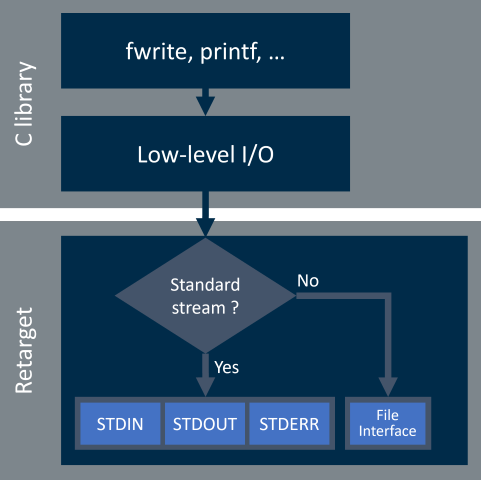
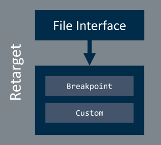
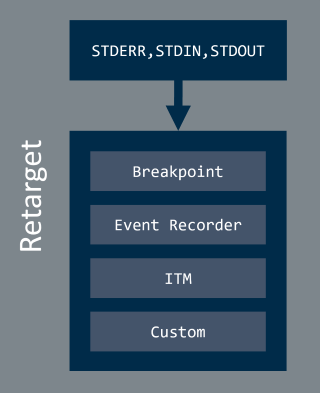

# Low-Level I/O Retarget {#rt_io}

CMSIS-Compiler splits low-level I/O retargeting into **standard I/O stream** related components and **file stream** related components.

The low-level I/O retarget decision tree is shown below:

Low-Level I/O retargeting implementation checks whether the incoming stream is a standard stream (i.e. stderr, stdin, stdout) or a file system related stream and redirects incoming request to the appropriate software component. Chapter \ref rt_io_components explains these software components in detail.

## I/O Components {#rt_io_components}

**CMSIS-Compiler:I/O** software component can retarget the input/output functions to the following channels:

 Component  |  Description
:-----------|:--------------------
 **File**   | Channel for all file stream related operations.
 **STDERR** | Standard error stream of the application to output diagnostic messages.
 **STDIN**  | Standard input stream going into the application (`scanf` etc.).
 **STDOUT** | Standard output stream of the application (`printf` etc.).
 **TTY**    | Teletypewriter, which is the last resort for error output.

> **Note**
> - **TTY** is only available for Arm Compiler toolchain.

Most retargeting channels have various \ref rt_io_variants.

### I/O Retarget Variants {#rt_io_variants}

The variant selection allows you to change the target hardware interface of the I/O channel.

#### I/O:File Variants {#rt_io_file_variants}

The following variants are available:

 Variant             | Description
:--------------------|:-------------------
 **File Interface**  | Use the \ref fs_interface_api API for file related operations.
 **Breakpoint**      | When the I/O channel is used, the application stops with [BKPT](https://developer.arm.com/documentation/100073/latest/The-Arm-C-and-C---Libraries/Support-for-building-an-application-with-the-C-library/Using-the-C-and-C---libraries-with-an-application-in-a-semihosting-environment?lang=en) instruction. No additional code is required.

#### I/O:STDERR/STDIN/STDOUT Variants {#rt_io_std_variants}

The following variants are available:

 Variant              | Description
:---------------------|:-------------------
**Breakpoint**        | When the I/O channel is used, the application stops with [BKPT](https://developer.arm.com/documentation/100073/latest/The-Arm-C-and-C---Libraries/Support-for-building-an-application-with-the-C-library/Using-the-C-and-C---libraries-with-an-application-in-a-semihosting-environment?lang=en) instruction. No additional code is required.
**ITM**               | Use [Instrumentation Trace Macrocell (ITM)](https://developer.arm.com/documentation/ddi0314/h/Instrumentation-Trace-Macrocell?lang=en) for I/O communication via the debugger (only available for Cortex-M3/M4/M7/M33/M55/M85 processors).  Usually, data is shown in a dedicated window.  No additional code is required to output or input data through the ITM channel. However, you have to configure the ITM channel for tracing.
**User**              | Retarget I/O functions to a user defined interface (such as \ref uct_usart "USART" or \ref uct_template "application specific"). See \subpage variant_User for further details.
**EVR**               | STDOUT can also be redirected using the [Event Recorder](https://arm-software.github.io/CMSIS-View/main/evr.html) (especially interesting for targets without ITM (such as Cortex-M0/M0+/M23)).

> **Note**
> - Depending on the selected variant, certain `#define` are set in the header file **RTE_Components.h** that enable the appropriate code sections in the retarget interface implementation file.
> - Retargeting **STDOUT** using the *EVR* variant is available for all Cortex-M based devices.
> - The [microlib](https://developer.arm.com/documentation/100073/latest/The-Arm-C-Micro-library?lang=en) of Arm Compiler C run-time library interfaces to the hardware via low-level functions. It implements a reduced set of high-level functions and therefore does not implement system I/O functions. Thus, in case of using the microlib, you cannot redefine the system I/O functions. Using any of the features of the Arm Compiler component provides the [assert](https://developer.arm.com/documentation/101754/latest/armasm-Legacy-Assembler-Reference/armasm-Directives-Reference/ASSERT-directive?lang=en) facility for microlib.

### I/O Retarget Variant "User" {#variant_User}

The CMSIS-Compiler:I/O component variant **User** provides code templates that help you to implement the functionality.

In Keil MDK µVision IDE, you can import the templates into a project using the context menu **Add New Item to Group** from the Project window. Depending on your selection, you get templates that support retargeting via display, USART, or keyboard. Also, a template for a custom implementation is available.

#### Input/Output via USART {#uct_usart}

You may use a [CMSIS-Driver USART](https://arm-software.github.io/CMSIS_5/develop/Driver/html/group__usart__interface__gr.html)
or write your own output routines. The following user code templates are available:

 Component   | Name                 | File Name
:-----------|:---------------------|:------------------------------------
 I/O:STDOUT | STDOUT via USART     | \ref stdout_USART_c "stdout_USART.c"
 I/O:STDIN  | STDIN via USART      | \ref stdin_USART_c "stdin_USART.c"
 I/O:STERR  | STDERR via USART     | \ref stderr_USART_c "stderr_USART.c"

> **Note**
> - To have the full flexibility for retargeting different channels to different target hardware, each USART user code template contains a function to initialize the USART. When using the same hardware for multiple channels, the initialization functions need to be merged in one single function. Call this function during the initialization of the device's peripherals.

#### Input/Output via Template {#uct_template}

Use these templates for custom interfaces that are not mentioned above. The following user code templates are available:

 Component   | Name                 | File Name
:-----------|:---------------------|:-----------------------------------
 I/O:STDOUT | STDOUT User template | \ref stdout_user_c "stdout_user.c"
 I/O:STDIN  | STDIN User template  | \ref stdin_user_c "stdin_user.c"
 I/O:STERR  | STDERR User template | \ref stderr_user_c "stderr_user.c"
 I/O:TTY    | TTY User template    | \ref tty_user_c "tty_user.c"

## File Interface Components {#rt_file_interface}

**CMSIS-Compiler:File Interface** software component provides generic shim layer interface between the C library and an arbitrary file system implementation.

Standard C library functions interact with files in a same manner as with standard I/O streams and offer the same retargeting interface. The existing interface is split to enable component interchangeability and \ref fs_interface_api API is used to enable quick file system retargeting.

Default component is as follows:

 Component      | Description
:---------------|:------------
 **Custom**     | Placeholder for custom \ref fs_interface_api implementation

**Custom** component is available to enable access to \ref fs_interface_api API header file when application provides an custom implementation. Custom implementation is typically needed when file system components do not provide its own implementation. To help you implement the functionality the File Interface:Custom component also provides the \ref retarget_fs_c "code template".

> **Note**
> - File Interface component is enabled when **I/O:File** variant **File Interface** is used.
