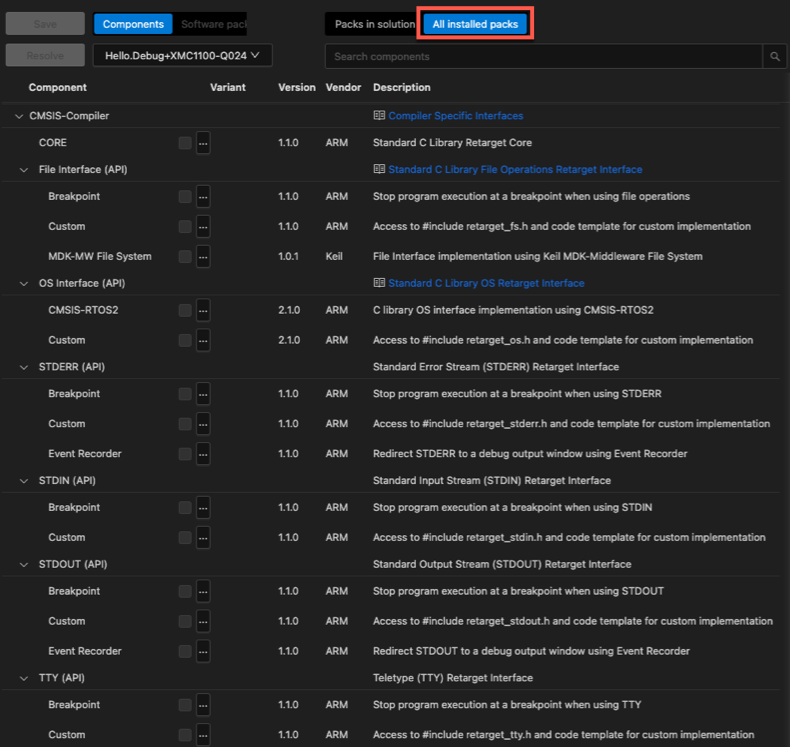

# Use CMSIS-Compiler {#usage}

The following steps are required to install the **ARM::CMSIS-Compiler** pack and to use the software components that
are shipped with the CMSIS-Pack.

> **Note**
>
> The installation and usage instructions are assuming you are using a
> [CMSIS-Toolbox](https://open-cmsis-pack.github.io/cmsis-toolbox/) based environment.

## Pack installation

Add the **ARM::CMSIS-Compiler** pack to your installation:

```sh
cpackget add ARM::CMSIS-Compiler
```

Alternatively, you can download the latest version from the
[CMSIS-Compiler](https://www.keil.arm.com/packs/cmsis-compiler-arm/versions/) page.

## Component selection and usage

1. In your IDE, open the
   [Manage software components](https://mdk-packs.github.io/vscode-cmsis-solution-docs/create_app.html#software-components)
   dialog.
2. If you cannot see the **CMSIS-Compiler** component, select to display **All installed packs**.
3. You must select the component **CMSIS-Compiler::CORE** and at least one additional **API**.



> **Note**
>
> Refer to the sections [Low-level I/O](./rt_io.md) and
> [Multithreading Support Retarget](./rt_os.md) for more information about the retargeting options.
