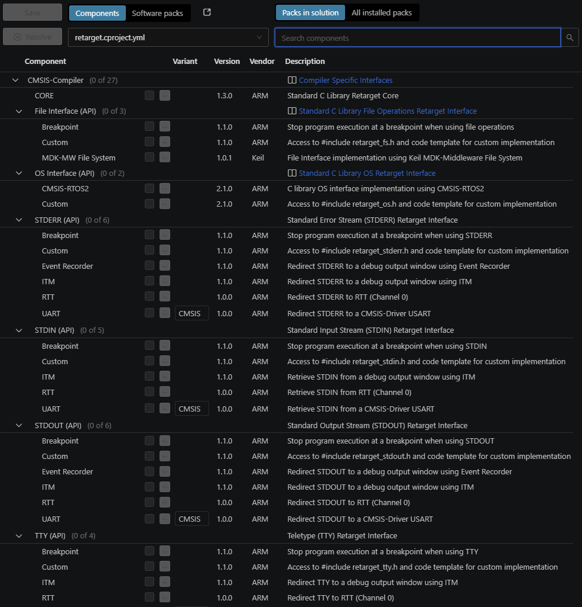
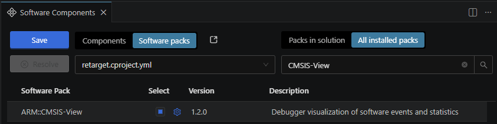
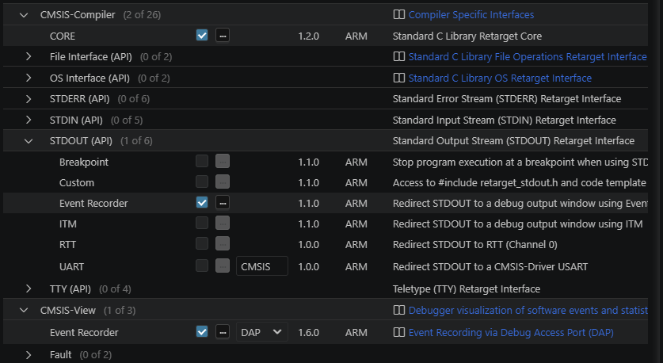
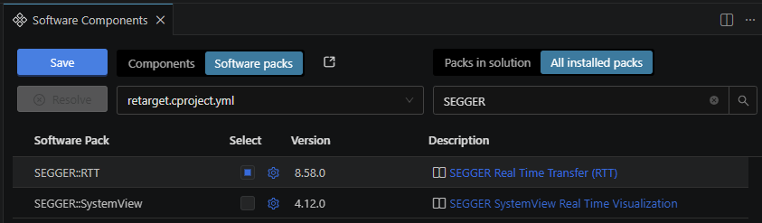
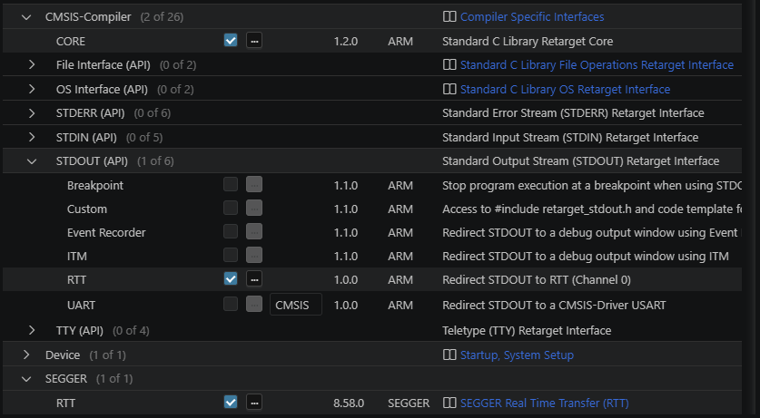
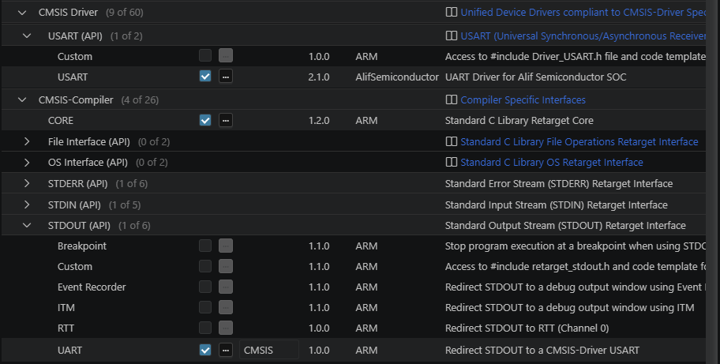

# Use CMSIS-Compiler {#usage}

The following steps are required to install the **ARM::CMSIS-Compiler** pack and to use the software components that
are shipped with the CMSIS-Pack.

> **Note**
>
> The installation and usage instructions are assuming you are using a
> [CMSIS-Toolbox](https://open-cmsis-pack.github.io/cmsis-toolbox/) based environment.

## Pack installation

Add the **ARM::CMSIS-Compiler** pack to your installation:

```sh
cpackget add ARM::CMSIS-Compiler
```

Alternatively, you can download the latest version from the
[CMSIS-Compiler](https://www.keil.arm.com/packs/cmsis-compiler-arm/versions/) page.

## Component selection

1. In your IDE, open the
   [Manage software components](https://mdk-packs.github.io/vscode-cmsis-solution-docs/create_app.html#software-components)
   dialog.
2. If you cannot see the **CMSIS-Compiler** component, select to display **All installed packs**.
3. You must select the component **CMSIS-Compiler::CORE** and at least one additional **API**.




## Resolve Dependencies {#usage_resolve_dependencies}

### Using Event Recorder {#usage_evr}

The **Event Recorder** subcomponent requires the `CMSIS-View::Event Recorder` component from the [CMSIS-View](https://www.keil.arm.com/packs/cmsis-view-arm/) pack.

1) Install the **CMSIS-View** pack:

   ```sh
   cpackget add ARM::CMSIS-View
   ```

2) In the **Manage Software Components** dialog, select **Software Pack**, then choose **All installed packs** and find and select **ARM::CMSIS-View**.

   

3) Select the **CMSIS-View::Event Recorder** component.

   

The project yml file should contain:

```yml
packs:
   - pack: ARM::CMSIS-Compiler
   - pack: ARM::CMSIS-View
```

```yml
components:
   - component: CMSIS-Compiler:CORE
   - component: CMSIS-Compiler:STDOUT:Event Recorder
   - component: CMSIS-View:Event Recorder&DAP
```

### Using RTT {#usage_rtt}

The **RTT** subcomponent requires the `SEGGER::RTT` component from the [SEGGER RTT](https://www.keil.arm.com/packs/rtt-segger/) pack.

1) Install the **SEGGER RTT** pack:

   ```sh
   cpackget add SEGGER::RTT
   ```

2) In the **Manage Software Components** dialog, select **Software Pack**, then choose **All installed packs** and find and select **SEGGER::RTT**.

   

3) Select the **SEGGER::RTT** component.

   

The project yml file should contain:

```yml
packs:
   - pack: ARM::CMSIS-Compiler
   - pack: SEGGER::RTT
```

```yml
components:
   - component: CMSIS-Compiler:CORE
   - component: CMSIS-Compiler:STDOUT:RTT
   - component: SEGGER:RTT
```

### Using UART {#usage_uart}

The **UART** subcomponent provides default implementation variant **CMSIS** which requires the `CMSIS Driver::USART` implementation, typically provided by a Board Support Pack (BSP) or Device Family Pack (DFP) for the target hardware.

> **Note**
>
> Use the [CMSIS Packs catalog](https://www.keil.arm.com/packs/) to find the appropriate pack for your target hardware.

1) Install the Board Support Pack (BSP) or Device Family Pack (DFP):

   ```sh
   cpackget add Vendor::Pack
   ```

2) In the **Manage Software Components** dialog, select **Software Pack**, then choose **All installed packs** and find and select installed BSP or DFP.

3) Select the **CMSIS Driver::USART** component.

   

The project yml file should contain:

```yml
packs:
   - pack: ARM::CMSIS-Compiler
   - pack: Vendor::Pack
```

```yml
components:
   - component: CMSIS-Compiler:CORE
   - component: CMSIS-Compiler:STDOUT:UART&CMSIS
   - component: CMSIS Driver:USART
```